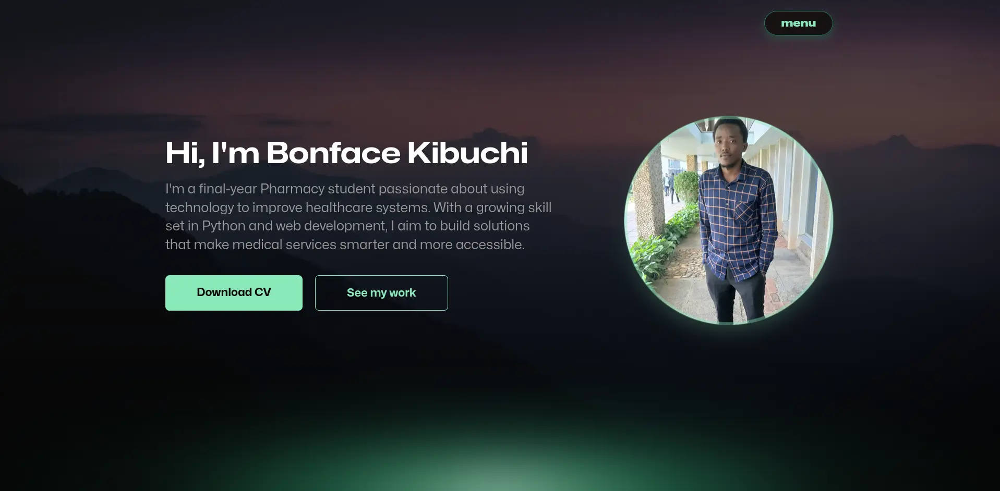

# 🌟 Bonface Kibuchi – Portfolio Website

This is the personal portfolio website of **Bonface Kibuchi**, a final-year Bachelor of Pharmacy student and aspiring software developer. The site showcases projects, skills, background, and blog articles—crafted with accessibility, performance, and clean design in mind.



---

## 🌐 Live Demo  
🔗 [Visit the Portfolio](https://kibuchi.github.io/kibuchi-portfolio)

---

## 🚀 Features

- 🌙 Light/Dark Theme Toggle (remembers your choice)
- 💻 Project Portfolio Showcase
- 📖 Personal Blog Articles
- 📬 Contact Form (integrated with EmailJS)
- 🎨 Responsive Hero Image
- 📱 Mobile-First, Fully Responsive Design
- 🧠 Semantic HTML, Clean CSS, Vanilla JS
- ♿️ Accessibility-Friendly Layout

---

## 🛠 Built With

- 🔤 **HTML5**
- 🎨 **CSS3** (with custom properties & media queries)
- ⚙️ **JavaScript** (Vanilla JS only)
- ✍️ **Fonts:** Mona Sans
- 🧩 **Design Tool:** Figma

---

## 📁 Folder Structure

```
📁 kibuchi-portfolio/
├── 📄 README.md
├── 📁 assets/
│   ├── 📄 Kibuchi CV.pdf
│   ├── 📁 fonts/
│   └── 📁 images/
│       └── 📁 work/
├── 📄 index.html
├── 📄 script.js
└── 📄 styles.css
```

---

## 🧪 Getting Started

To run the project locally:

```bash
git clone https://github.com/Kibuchi92/kibuchi-portfolio.git
cd kibuchi-portfolio
firefox index.html
```

---

## 📬 Contact

- 📧 **Email:** bonfacekibuchi00@gmail.com 
- 🐙 **GitHub:** [@Kibuchi92](https://github.com/Kibuchi92)  
- 💼 **LinkedIn:** [Bonface Kibuchi](https://www.linkedin.com/in/bonface-kibuchi-159a0123b)  
- 🐦 **Twitter/X:** [@Mr_Kibuchi](https://x.com/Mr_Kibuchi)
